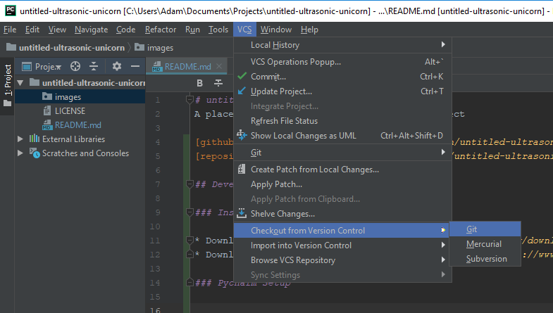
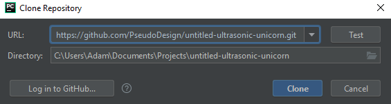

# untitled-ultrasonic-unicorn
A placeholder for the ultrasonic unicorn project

[github_page]: https://github.com/PseudoDesign/untitled-ultrasonic-unicorn
[repository]: https://github.com/PseudoDesign/untitled-ultrasonic-unicorn.git

## Development Environment Setup

### Install Required Software

* Download and install [Python 3.7](https://www.python.org/downloads/)
* Download and install a recent version of [PyCharm](https://www.jetbrains.com/pycharm/download)
* Download and install [git](https://git-scm.com/downloads)

### PyCharm Setup

#### Clone the Repository

* From the PyCharm menu bar, select `VCS->Checkout from Version Control->git`:

* Click `Log in to GitHub...` and provide your login information

* Paste the link to the [repository] and select `Clone`

#### Pipenv Setup

Follow the instructions provided on [PyCharm's website](https://www.jetbrains.com/help/pycharm/pipenv.html).
The Pipfile already exists for this project